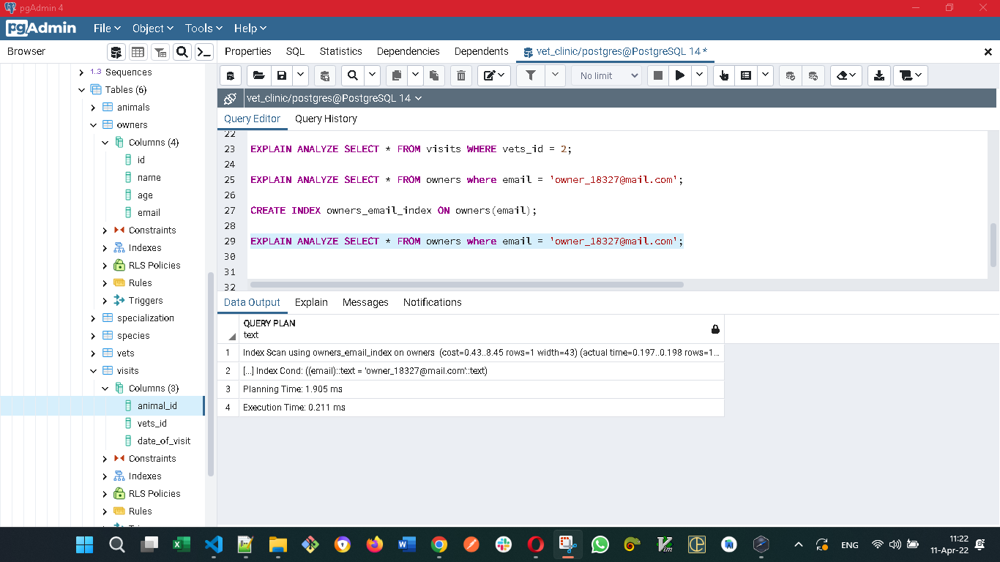

# Vet Clinic Database

> Database of the veterinary clinic Vet Clinic - In the upcoming projects, we use a relational database to create the data structure for a vet clinic. we start with one table, and step by step, we create a complete database with data about: [animals, animal's owners, clinic employees, visits] 

| Before optimization  | Optimization  | After optimization   |
|---|---|---|
|   |`CREATE INDEX visits_animals_index ON visits(animals_id);`   |   |
|   | `CREATE INDEX visits_vets_index ON visits(vets_id desc);` |   |
|   | `CREATE INDEX owners_email_index ON owners(email);`  |   |

## Getting Started

This repository includes files with plain SQL that can be used to recreate a database:

- Use [schema.sql](./schema.sql) to create all tables.
- Use [data.sql](./data.sql) to populate tables with sample data.
- Check [queries.sql](./queries.sql)  that contains the querries

## How to use this repository

If not installed instal [Git](https://git-scm.com/download/win), and [PostgreSQL](https://www.postgresql.org/download/)

 - Clone this repository by typing `git clone https://github.com/david-lafontant/vet-clinic.git`
 - Go to the cloned repository by typing `cd vet_clinic`
 - Open the `.sql' files by using your favorite editor
 - Use PostgreSQL user interface (pgAdmin) or command line to run in the following order:
  1 - schemas.sql
  2 - data.sql
  3 - data.sql

## Authors

👤 **David Lafontant**

- GitHub: [@david-lafontant](https://github.com/david-lafontant)
- Twitter: [@manikatex](https://twitter.com/manikatex)
- LinkedIn: [LinkedIn](https://www.linkedin.com/in/david-lafontant/)

👤 **Muhammad Rizo Abdunazarov**

- GitHub: [@mukhammadrizooff](https://github.com/mukhammadrizooff)
- Twitter: [@Muhammadrizooff](https://twitter.com/Muhammadrizooff)
- LinkedIn: [LinkedIn](https://www.linkedin.com/in/mukhammadrizooff/)

## 🤝 Contributing

Contributions, issues, and feature requests are welcome!

Feel free to check the [issues page](../../issues/).

## Show your support

Give a ⭐️ if you like this project!

## Acknowledgments

- Hat tip to anyone whose code was used

## 📝 License

This project is [MIT](./MIT.md) licensed.
